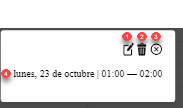

## generarCabecera

* Genera la cabecera de las fechas de la semana. 
* El formato de fechas es DDD dd
  DDD = Ejemplo: LUN, MAR, MIE... 
  dd = dia del mes: 01, 10, 22...
* Recibe: fechas, posHoy
  * fechas => array con las fechas de esa semana.  El formato es: LUN-16-10


## informarEventos

* Rellena el calendario con los horarios de riego. Por elemplo: lunes 16-10 de 01:00h a 04:00h. Colorea en azul esta parte del calendario. 
* Ejemplo de registros ´{ fecha: '16-10-2023', titulo: 'Riego Patatas', horaInicio: '01:00', horaFinal: '04:00' }, ´


# Planificar nuevo riego. 

1. El usuario hace clic en una celda, se abre el modal. [mostrarDatosRiegoInput]
2. Se compruba si tiene o no el atributo 'data-id'
   Si no lo tiene (nuevo riego)
   1. Extraemos del id de [e.target.id] la celda seleccionada la siguiente información:
      * diaSemana, 
      * diaMes
      * mes
      * horaInicio
    2. Activamos por defecto en el SELECT de fecha, la fecha del dia actual. 
       * Se recorren las opciones del campo SELECT hasta enontrar la que concicia con el dia de la semana. ``` fechaSelecionada.includes(diaSemana) ``` 
       * Se activa la propiedad **selected** para esta opción. 
    
    Al pular en el botón 'Regar', se llama a: [grabarRiego]




1. Editar el riego 

  * id = editarRiego

2. Borrar el riego

  * id = borrarRiego

3. Cerrar modal Modif-Borrar. 


Se rellena los datos: titulo (ej: riego de patatas), la hora de inicio y la hora de final.
3. Se pulsa en guardar
*   Se cierra el modal -> closeModal. 
*   Se graba el riego -> grabarRiego

# Borrado de riego. 
1. A cada una de las celdas asociadas a un riego, se le agrega el atributo: **data-id**
  
  ```html
    <td id="MAR-17-10-01" data-id="id-1697964107108-9052" style="background-color: rgb(210, 227, 252);"></td>
  ```
2. En el array de riegos se genera un objeto con ese id para asociarselo a esas celdas. 
```json
  {id: 'id-1697964107108-9052', fecha: '19-10-2023', titulo: 'ajos', horaInicio: '01:00', horaFinal: '13:00'}
```
3. Si se hace clic en cualquiera de las celdas de un mismo riego, con el mismo id y se hace clic en el boton borrar. Se elimina del array el elemento por id. 

4. 